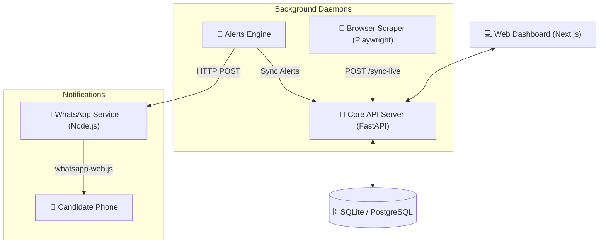

# 🚀 JobPilot — AI-Powered Autonomous Job Application Platform

JobPilot is a premium, state-of-the-art career operating system that finds, matches, and automatically applies to jobs on your behalf. Powered by advanced AI matching, automated browser scrapers, and instant WhatsApp notifications, it operates as a completely autonomous job search companion.

---

## 🏗️ System Architecture



---

## ⚡ Quick Start

### Prerequisites
* **Python 3.11+**
* **Node.js 18+**
* **Docker Desktop** (optional, if using PostgreSQL + Redis instead of SQLite)

---

### 1. Set Up Backend API Service
1. Navigate to the backend directory:
   ```bash
   cd backend
   ```
2. Create and configure your `.env` file (see [Configuration](#-configuration)):
   ```bash
   cp .env.example .env
   ```
3. Install dependencies:
   ```bash
   pip install -r requirements.txt
   ```
4. Install Playwright browser binaries (required for scraper/auto-apply daemons):
   ```bash
   playwright install chromium
   ```
5. **Start the backend server:**
   > [!IMPORTANT]
   > For Windows systems enforcing strict corporate **Device Guard** policies, raw executable files like `uvicorn.exe` will be blocked. You must run the server using the signed Python executable:
   ```bash
   python -m uvicorn main:app --reload --host 0.0.0.0 --port 8000
   ```
   * API base URL: `http://localhost:8000`
   * Interactive API docs: `http://localhost:8000/docs`

---

### 2. Set Up WhatsApp Notification Service
JobPilot includes an instant notification wrapper that dispatches job matches directly to your phone.
1. Navigate to the WhatsApp service directory:
   ```bash
   cd backend/whatsapp_service
   ```
2. Install Node.js dependencies:
   ```bash
   npm install
   ```
3. Start the service:
   ```bash
   npm start
   ```
   * The service starts on port `8005`. 
   * Scan the generated QR code in your terminal using WhatsApp's "Linked Devices" option to authenticate the client session.

---

### 3. Set Up Frontend Web Dashboard
1. Navigate to the frontend directory:
   ```bash
   cd frontend
   ```
2. Install dependencies:
   ```bash
   npm install
   ```
3. Start the development server:
   ```bash
   npm run dev
   ```
   * Web Dashboard URL: `http://localhost:3000`

---

## 📖 How to Use

Follow this step-by-step workflow to unlock the full potential of JobPilot:

### 1. Register & Log In
1. Open your browser and navigate to `http://localhost:3000/signup`.
2. Register a new candidate account.
3. Log in to access your protected candidate dashboard.

### 2. Upload & Parse Your Resume
1. Go to the **Resume** section in the sidebar.
2. Drag and drop or upload your resume in **PDF format**.
3. The platform's AI (Gemini/OpenAI) will automatically parse your structured data (experience history, skills list, education) and construct your interactive **AI Candidate Profile**.

### 3. Customize Your Job Preferences
1. Go to the **Settings** section.
2. Define your **Target Roles** (comma-separated, e.g., `Python Developer, React Engineer`).
3. Set your **Target Locations**, **Expected Salary**, and your current **Years of Experience** (this will be used as the default filter value for all search queries).
4. Add your preferred AI API keys (Google Gemini, OpenAI, or NVIDIA NIM credentials).

### 4. Enable WhatsApp Job Alerts
1. Ensure the WhatsApp background service is running and authenticated (QR code scanned in your terminal).
2. Go to the **WhatsApp** section on the dashboard.
3. Add your target phone number (with country code, e.g., `919576572201`) as a contact.
4. Toggle **"Notify on High Match"** or **"Notify on New Jobs"** and set your target matching threshold (e.g., `70%`).

### 5. Launch Live Scrapers
1. Navigate to the **Jobs** dashboard.
2. You will see platform daemon controls for **LinkedIn**, **Naukri**, and **Wellfound**.
3. Click **"Start Daemon"** on the platforms you want to monitor.
4. The background Playwright crawler will launch in headless/headed mode and scrape active listings matching your target roles every few minutes, syncing them to your database.

### 6. Filter & Track Jobs
1. Scraped jobs will appear in your feed with a **🎯 Match Percentage Ring** computed dynamically by the AI matching engine.
2. Adjust the **"Yrs of Exp"** filter in the filter bar to strictly see jobs compatible with your years of experience.
3. Click on any job card to view its description, strengths, missing skills, and unique cover letter angles generated by the AI.
4. Save jobs to add them to your Kanban-board application tracker (**Applications** tab).

### 7. ⚡ Auto Apply with AI
1. On the Job Details card, click **⚡ Auto Apply with AI**.
2. The Playwright automation agent will open the job's application portal, analyze form fields (even custom ones), fill them in using your profile data, and submit the application autonomously on your behalf.

---

## 🤖 Core Subsystems

### 1. Live Platforms Scraper (`linkedin_live_browser.py`)
Runs in the background using Playwright to periodically fetch active listings across three major job platforms:
* **LinkedIn:** Scrapes recent job posts and keywords-based search results.
* **Naukri:** Scrapes matching job cards, extracting job titles, company names, and experience requirements.
* **Wellfound:** Scrapes job posts parsing the JSON NEXT_DATA apolloState block directly to extract salary ranges, locations, and experience boundaries.

### 2. Strict Experience-Based Match Engine
Ensures candidates only receive notifications and listings matching their profile:
* **Precedence Parser:** Regex engine prioritizing ranges (`3 to 5 years`) over single boundaries (`5+ years`) to prevent parsing conflicts.
* **Filter Gate:** A job matches if:
  $$\text{req\_min} \le \text{user\_exp} \le \text{req\_max} + 2$$
* **Interactive Frontend Filter:** A "Yrs of Exp" numeric selector in the jobs search page updates listings in real-time, pre-filling from your settings by default.

---

## 🔑 Configuration

### Backend Environment Variables (`backend/.env`)
```ini
DATABASE_URL=sqlite+aiosqlite:///./jobpilot.db
SECRET_KEY=your-jwt-signing-secret
ALGORITHM=HS256
ACCESS_TOKEN_EXPIRE_MINUTES=30

# AI Provider Configurations
OPENAI_API_KEY=sk-...
OPENAI_MODEL=gpt-4o-mini

# NVIDIA NIM Configurations (Optional)
NVIDIA_API_KEY=nvapi-...

# SMTP Email configurations (Optional, placeholders are ignored automatically)
SMTP_HOST=smtp.gmail.com
SMTP_PORT=587
SMTP_USER=your-email@gmail.com
SMTP_PASSWORD=your-app-password
```

---

## 🛠️ Troubleshooting

### 1. Port 8005 or 8000 Already in Use
If you receive `EADDRINUSE: address already in use :::8005`, identify and kill the process:
* **Windows (PowerShell):**
  ```powershell
  Get-Process -Id (Get-NetTCPConnection -LocalPort 8005).OwningProcess | Stop-Process -Force
  ```

### 2. Next.js 404 Route Errors / Compilation Failures
If routes fail to render or return 404 after restarting development servers:
1. Clear the cached Next.js folders:
   ```bash
   rm -rf frontend/.next
   ```
2. Recompile the production or dev bundle:
   ```bash
   npm run build
   ```

### 3. SMTP BadCredentials Errors
If the background service logs connection authentication warnings, ensure you are using a valid **Gmail App Password** instead of your raw Google account password. The backend automatically bypasses connection cycles if default templates are detected.
